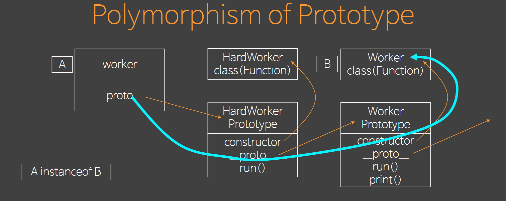
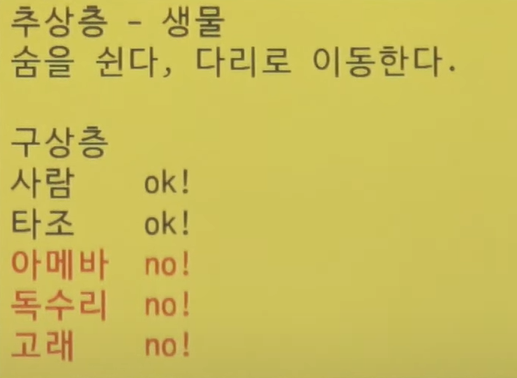
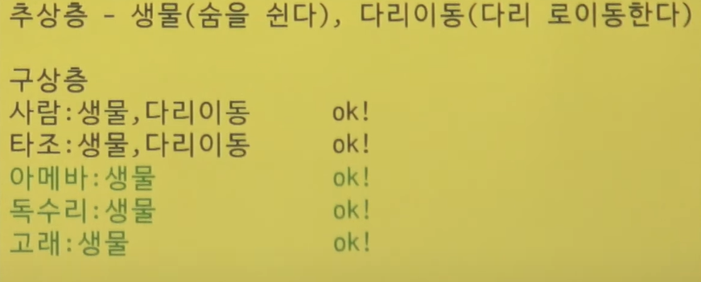
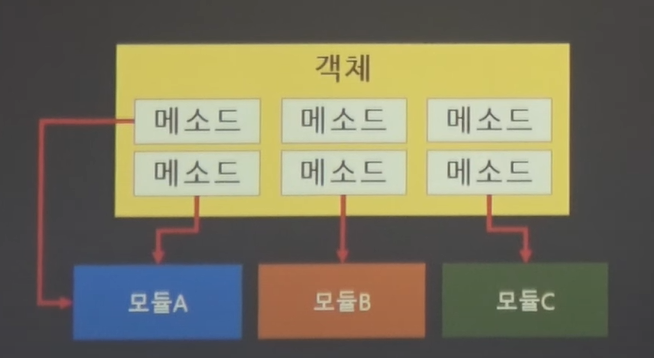
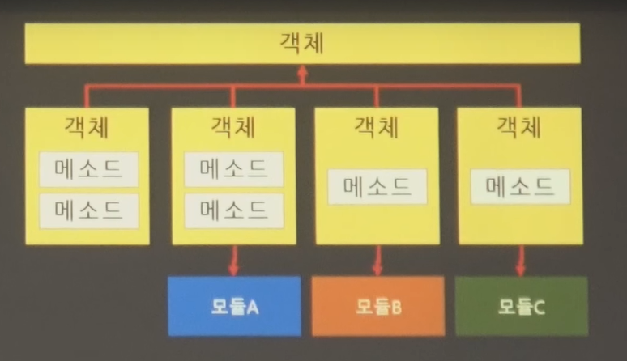
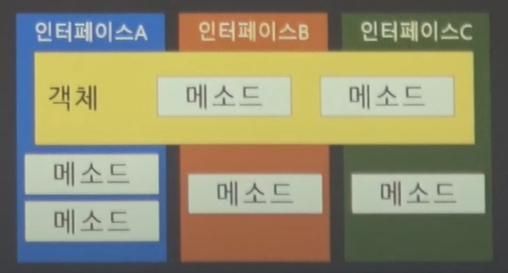

## 1. Value Context vs Identifier Context

함수형 프로그래밍인지, 객체지향 프로그래밍인지 프로시저 프로그래밍인지
를 구분하는 잣대보단 값이라는 컨텍스트를 사용할지 식별자 기반 컨텍스트를 사용할지가 중요하다.

Value Context는 메모리 주소와 관계없이 그 값이 같다면 같다고 생각하는 관점이다. 예를 들어 변수 a,b가 모두 3이라는 값을 가지고 있다면 다른 메모리 상에 존재한다고 해도 같다고 판단한다.
어떤 변수에 저장되어 있는지 보단, 어떤 값을 가지고 있는지가 중요하다.

반대로 Identifier Context는 같은 값이라도 메모리 주소가 다르다면 다른 값이라고 생각하는 관점이다.

객체지향 프로그래밍은 value context를 배제한다. 특별한 상황을 제외하고는
둘 중 하나의 컨텍스트를 사용하는 것을 권장한다.

```js
const a = {
  a: 3,
  b: 5,
};
const b = {
  a: 3,
  b: 5,
};

console.log(a === b); // Identifier context
console.log(JSON.stringify(a) === JSON.stringify(b)); // Value context
```

Value context 특징:

- 끝 없는 복사본을 생성한다.
- 상태 변화에 안전하다.
- 연산을 기반으로 로직을 전개한다.

Identifier context 특징:

- 하나의 원본 사용
- 상태 변화를 내부에서 책임짐
- 메세지를 기반으로 로직을 전개 -> 로직을 위임 가능
- 객체지향은 항상 Identifier를 인자로 받아야 한다. 즉, 숫자를 받으면 안 된다. 객체지향에서 값을 받는 것은 오직 생성자 밖에 없다.

## 2. Polymorphism(다형성)

부모는 자식을 대체할 수 없지만, 자식은 부모를 대체할 수 있다.
확장된 클래스는 확장할 클래스를 대체할 수 있다는 것이 Polymorphism의
핵심이다. 이것을 Polymorphism 안에서 **대체가능성(substitution)** 이라고 한다.
**내적일관성(internal identity)** 은 어떠한 경우에도 태어났을 떄 원본 클래스를 유지하려는 속성이다. Ploymorphism은 이러한 대체가능성과 내적일관성을 합친 것이다.

```js
const Worker = class {
  run() {
    conosle.log("working");
  }
  print() {
    this.run(); //내적일관성
  }
};

const HardWorker = class extends Worker {
  run() {
    console.log("hardWorking");
  }
};

const worker = new HardWorker();
console.log(worker instanceof Worker); //대체가능성
worker.print();
```

**Polymorphism의 정체** :

확장된 객체는 원본으로 대체 가능하며 생성 시점의 타입이 내부에 일관성 있게 참조된다. 각 언어마다 굉장히 다른 시스템을 사용하지만, 객체지향이라고 불리기 위해선 어떤 형태로든 대체가능성과 내적가능성을 유지할 수 있어야한다. 즉, 객체지향언어는 Polymorphism을 언어차원에서 지원한다.

## 3. Polymorphism of Prototype

javascript는 prototype을 이용해서 대체가능성과 내적일관성을 유지한다.

<p align="center">
  
</p>

## 4. Object essentials

```js
const EssentialObject = class {
  #name = "";
  #screen = null;
  constructor(name) {
    this.#name = name;
  }
  camouflage() {
    this.#screen = (Math.random() * 10).toString(16).replace(".", "");
  }
  get name() {
    return this.#screen || this.#name;
  }
};
```

- **hide state(은닉) - Maintenance of State**: 객체의 모든 속성은 private으로 선언(데이터 은닉)
  - : 객체지향은 메모리의 참조로 움직여야 하는데 속성이 공유되는 순간 속성을 값으로 취득해서 쓰기 때문에 값 컨텍스트가 프로그램 전체에 만연하게 되고,
    결국에는 값 컨텍스트로 인해 객체지향이 무너지게 된다.
  - : 내부의 상태를 감춘다.
  - : 자신의 상태에 대한 관리의 책임이 있어야 한다.
- **encapsulation(캡슐화) - Encapsulation of Functionality**: 내부에서 무슨 일이 일어나는지 노출하면 안 된다(객체의 메소드에서 일어나는 일은 외부에서 알면 안 된다)
  - : ATM은 내부적으로 굉장히 복잡하게 작동하지만, 사용자는 그러한 일들에 대해 알 필요도 없고 알아서도 안 된다.
  - : 외부에서 내부의 일을 모르게 한다.
  - : 예를 들어 setAge 라는 method는 캡슐화에 위배될 수 있다. setChild setAdult 같은 method로 캡슐화할 수 있다.

이 두가지 본질을 보장하는 객체는 변화에 대한 해당 객체의 격리구간을 만들 수 있다.(Isolation of change)
함수형 프로그래밍이나 객체지향 프로그래밍은 변화에 대한 격리에 초점을 맞춘다.

```
객체지향의 목표:
객체지향의 목표는 격리의 벽을 세워 변화의 여파가 다른 코드로 전이되지 않도록 하는 것이다. 그리고 변화의 여파를 막고 격리의 벽을 세울 수 있는 유일한 수단이 바로 앞서 설명한 캡슐화와 데이터 은닉이다.
```

## 5. SOLID 원칙

로버트 마틴이 2000년대 초반에 명명한 객체 지향 프로그래밍 및 설계의 다섯 가지 기본 원칙이다.
프로그래머가 시간이 지나도 유지 보수와 확장이 쉬운 시스템을 만들고자 할 때 이 원칙들을 함께 적용할 수 있다.
SOLID 원칙들은 소프트웨어 작업에서 프로그래머가 소스 코드가 읽기 쉽고 확장하기 쉽게 될 때까지 소프트웨어 소스 코드를 리팩터링하여 코드 냄새를 제거하기 위해 적용할 수 있는 지침이다.
애자일 소프트웨어 개발 (opens new window)과 적응적 소프트웨어 개발 (opens new window)의 전반적 전략의 일부이다.

- SRP(Single Responsibility) : 단일책임 원칙

  - 수정해야 하는 원인이 하나 밖에 없다. (코드를 고쳐야할 이유는 하나이다.) SRP를 지키지 못하면 일어나는 산탄총수술(Shotgun surgery)이 있다.

  - **산탄총수술** : 객체 하나를 건들이면 수많은 사이드이펙트가 생긴다.

- OCP(Open Closed) : 개방폐쇄 원칙

  - 확장에는 열려 있고(extends 나 implements), 요구사항이 변경되었을 때 객체의 수정은 닫혀있다.( 기존의 class를 건드리는 게 아니라 extends나 implements로 구현해야 한다.)

- LSP(Liskob Substitusion) : Liskov 치환 원칙, 업캐스팅 안전

  - 부모 쪽으로 업캐스팅하는 것이 안전함을 보장한다.
  - 추상층의 정의가 너무 구체적이면 구상층의 구현에서 모순이 발생한다.

아래의 사진과 같이 추상층이 구체적이면 구상층의 구현에서 모순이 발생한다. 아래와 같은 경우에
Liskov 치환 원칙을 위배한다.

<p align="center">
  
</p>

아래와 같이 다리로 이동한다를 제외하면 모두가 행복하면서도 업캐스팅에 안전하다. 하지만 몇몇 동물은 다리로 이동한다는 기능을 잃어버렸다.

<p align="center">
  
</p>

아래와 같이 두가지 추상층으로 분리한 이후 적용하면 모두가 행복하면서도 업캐스팅에 안전하게 작성되었다.

<p align="center">
  
</p>

```
사람 extends 생물
타조 extends 생물
아메바 implements 다리로 이동하는 생물
독수리 implements 다리로 이동하는 생물
고래 implements 다리로 이동하는 생물
```

- ISP(Interface Segregation) : 인터페이스분리 원칙
  - 위의 사례와 같이 LSP를 위반하는 사례를 ISP를 통해 해결할 수 있었다.
  - 인터페이스를 분리해서 문제를 해결한다.

아래와 같이 여러 모듈이 하나의 객체의 여러 기능에 의존한다. 역할에 따라서 본다면 서로 다른 모듈은
공통된 메서드를 사용하지 않는다. 즉, 각 모듈마다 하나의 객체를 바라보는 관점이 다르다.
상태의 본질은 다른 사람에게 위임할 수 없기 때문에 의존되는 객체는 메서드를 모두 가지고 있어야한다.
이렇게 모든 메서드가 구분이 안되면 모든 모듈은 의존되는 객체를 인식하게 된다. 나중에 객체가 변경된다면 이 부분에서 문제가 생길 수 있다.

<p align="center">
  
</p>

인터페이스를 분리하지 않는 방법 중 하나는 소유(위임)를 사용해서 이 문제를 해결하는 것이다. 상위 객체의 분신을 여러개를 만든다. 분신들은 상위 객체의 자식이기 때문에 상위 객체의 상태를 공유할 수 있다.

<p align="center">
  
</p>

상위 객체를 만들 때, 여러 인터페이스로 분리하고
인터페이스에 맞게 오버라이드해서 구현한다.

<p align="center">
  
</p>

- DIP(Dependency inversion) : 의존성 역전의 법칙, 다운캐스팅 금지

  - 의존성은 부모쪽으로 흘러야한다.
  - 다른 solid 원칙이 지켜져야 다운캐스팅을 막을 수 있다.
  - 고차원의 모듈(더 자식 쪽)은 저차원의 모듈에 의존하면 안된다. 이 두 모듈 모두 추상화된 것에 의존해야 한다.
  - 추상화 된 것은 구체적인 것에 의존하면 안된다. 구체적인 것이 추상화된 것에 의존해야한다.

- **DI(dependency injection)** : IoC(제어역전)의 일부분이다.
- **DRY** : Don't Repeat Yourself : 중복방지
- **Hollywood Principle** : 의존성 부패방지, 시간날 때 나한테 연락줘(요청), 시간날때 내가 연락할게

  - 질의가 아닌 요청
  - 물어보지 말고 요청하거나 기다려라.
  - Action을 처리할 대상이 요청하게 해야 한다.
  - 연락처를 물어보는 것 (X)
  - 상대방이 연락처를 알려준 직후에 전화번호를 바꾼다면?
  - 연락을 달라고 하는 것(연락처를 주는 것) (O)
  - => 이것이 지켜지지 않는다 = 은닉or캡슐화가 지켜지지 않은 것

- **Law of demeter** : 최소지식, 어떤 객체에 대한 지식을 알때 최소한으로 알아야한다 그렇지 않으면 의존성 부패가 일어난다.
  - classA.methodA의 최대지식 한계
    - classA의 필드 객체
    - methodA가 생성한 객체
    - methodA의 인자로 넘어온 객체
      => 지키지 않으면 열차전복(train wreck)상태
      => 원래 알아야하는 대상보다 더 많은 객체를 알아버리기 때문이다.

## 6. Message

객체 지향 세계에서는 SRP를 준수하는 객체망(Object Network)이 메시지를 이용해서 문제를 해결한다.

단일 책임 원칙을 준수하는 객체에게 책임 이상의 업무를 부여하면

1. 만능 객체가 되려한다.
2. 다른 객체에게 의뢰한다.

=> 다른 객체에게 의뢰하는 것은 다른 객체에게 메시지를 보내는 것이다.

```
1. 메시지 - 의뢰핧 내용
2. 오퍼레이션 - 메시지를 수신할 객체가 제공하는 서비스
3. 메소드 - 오퍼레이션이 연결될 실제 처리기
```

메시지를 전달하는 객체의 메서드는 오퍼레이션이다. 내부에서 어떻게 메소드가 맵핑될지는 모르기 때문에
메소드와 오퍼레이션은 차이점이 있다. 이러한 맵핑은 런타임 중에 결정된다. 이를 동적 바인딩이라고 한다. 동적바인딩을 지원하는 언어에서는 오퍼레이션과 메소드가 틀릴 가능성이 높다.

추상 클래스를 상속받게 만들거나, 인터페이스를 구현하는 이유는 오퍼레이션과 메소드를 분리해서 런타임에 원하는 것을 가져오기 위해서이다. 이게 결국 OCP를 만들어낸다.

즉, SRP를 통해 문제를 해결하게 되는 과정에 OCP가 만들어진다.

## 7. Dependency

의존성은 격리(가장 중요함)의 문제이다.
격리성을 갖는가는 의존성을 어떻게 관리 했는가와 관련이 있다. 의존성이 아예 없는 것과
강한 것의 중간이 제일 좋다.

**의존성의 종류**

1. 객체의 생명 주기 전체에 걸친 의존성

- 상속(extends) : 상속 받는 모든 객체가 부모 객체를 쓰면 반드시 망가진다 - 위험도가 높다(의존성이 강력하다)
- 연관(association) : 다른 객체를 알고 있다(소유하고 있다)
  => 상속을 연관(소유)로 바꾼다.

2. 각 오퍼레이션 실행 시 임시적인 의존성

- 의존(dependency) : 메소드 호출이 끝나면 의존성 종료
  : 메서드 안에서 만들어 내는 객체나 인자로 들어온 객체는 메서드를 실행할 때만 의존성이 임시적으로 생김

**의존성이 높으면 생기는 일**:

1. 수정 여파 규모증가
2. 수정하기 어려운 구조 생성
3. 순환 의존성

객체지향을 배우는 이유는 격리 구간을 세우고 의존성을 관리하기 위해서다. 즉, 변화에 대한 격리를 위해 객체지향을 하는 것이다.

## 8. dependency inversion

어떠한 경우에도 다운캐스팅은 금지, 폴리모피즘(추상인터페이스) 사용

- DIP는 OCP(개방폐쇄원칙)와 깊은 관계.
- OCP가 안 되면 DIP도 안된다.

```js
const Worker = class {
  run() {
    conosle.log("working");
  }
  print() {
    this.run(); //내적일관성
  }
};

const HardWorker = class extends Worker {
  run() {
    console.log("hardWorking");
  }
};

const Manager = class {
  #workers;
  constructor(...workers) {
    //OCP 달성 -> 의존성 역전 달성
    if (workers.every((w) => w instanceof Worker)) this.#workers = workers;
    else throw "invalid workers";
  }
  doWork() {
    this.#workers.forEach((w) => w.run());
  }
};

const manager = new Manger(new Worker(), new HardWorker());
manager.doWork();
```

## 9. Inversion of Control

DIP도 IOC를 위한 재료이다. 궁극적으로 도달해야하는 범위가 IOC이다. SOlID도 IOC를 지향한다.
IOC는 객체지향의 궁극적인 목표. 모든 원칙을 달성해야 도달할 수 있다.

```
Inversion
역전
위임 하겠다
대체 하겠다
제어에 대해서 다른 어떤한 것에게 위임하는 것.
```

**제어역전의 개념과 필요성** :

개념:

- 1. Control = flow control(흐름제어)
- 2. 광의에서 흐름 제어 = 프로그램 실행 통제
- 3. 동기흐름제어, 비동기 흐름제어 등

문제점 :

- 1. 흐름 제어는 상태와 결합되어 진행됨
- 2. 상태 통제와 흐름제어 = 알고리즘
- 3. 변화에 취약하고 구현하기도 어려움

```
제어 흐름이 어려운 이유

흐름 제어는 상태와 결합하여 진행됨
루프가 진행될수록 루프가 다루는 상태를 예측하기가 힘들다.
상태 통제와 흐름 제어 = 알고리즘
변화에 취약하고 구현하기도 어려움
제어문을 만들기도 힘든데, 제어문을 유지보수 하는 것은 더 어렵다.
```

대안 :

- 1. 제어를 추상화하고
- 2. 개별 제어의 차이점만 외부에서 주입받는다.

```
대안
제어를 추상화하고 한 번만 만들자(한 번의 if, 한 번의 roop)
일반화라는 관점이 필요하다.
"달라보이지만 같다" - 연역적 추리, 귀납적 추리
하나를 가르쳤더니 열 개를 안다 = 연역적 사고(원리를 안다)
현상으로 부터 원리를 알고 원리를 적용한다.
개별 제어의 차이점만 외부에서 주입 받는다.
```
