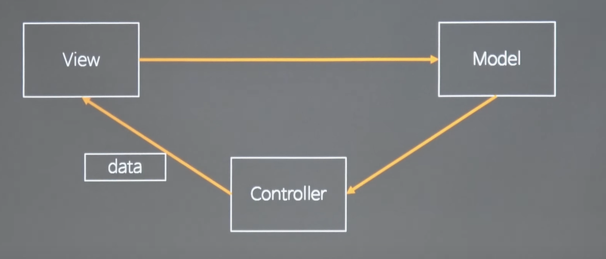
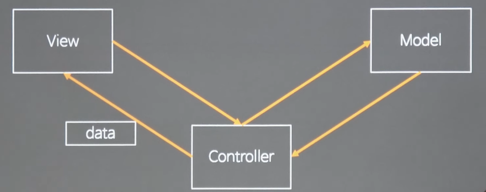
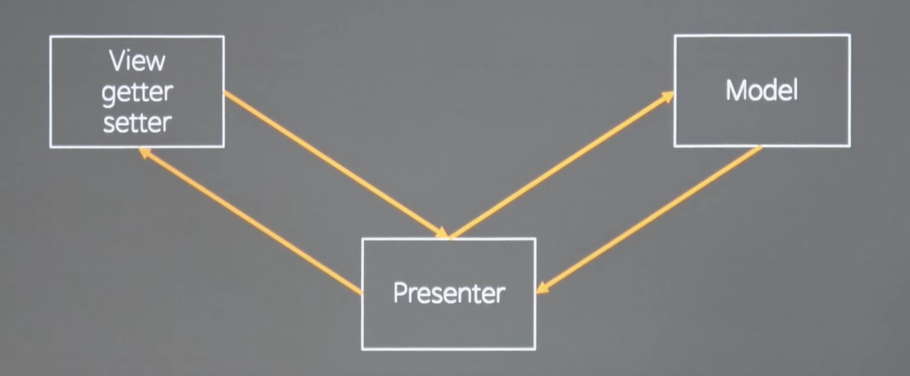
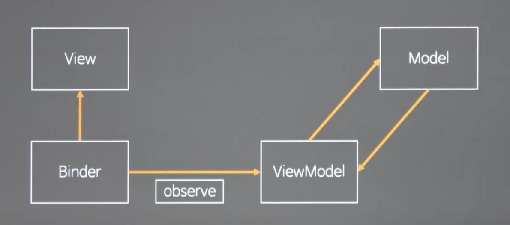
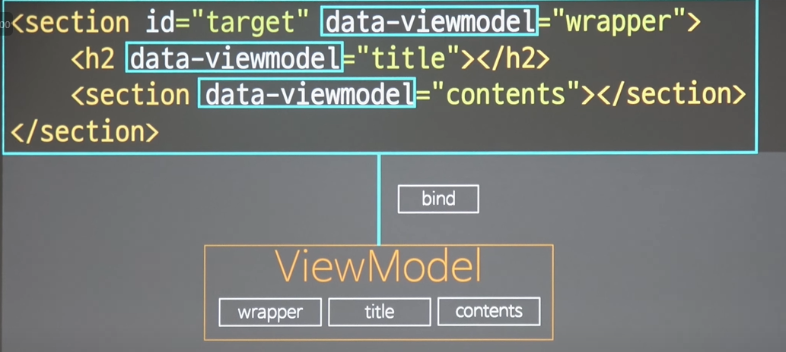
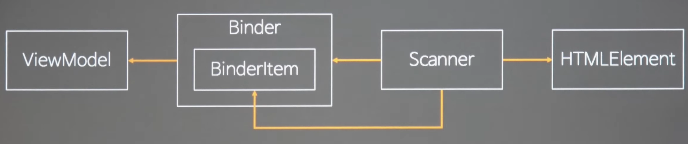

## 1. MVC

model-view-controller가 있다. mvc에는 두가지 방법이 있다.

**1. 고전적인 mvc 모델** : 모델을 컨트롤러가 가져와서 뷰가 소비할 수 있는 형태로 데이터를 가공해서 뷰한테 전달한다.

<p align="center">
    
</p>

- 컨트롤러가 모델을 알고 있다.
- 컨트롤러가 뷰도 알고 있다.
- 뷰는 유저의 인터랙션을 받아들여서 모델을 갱신한다.
- 뷰는 자기가 실제로 어떠한 모델을 갱신해야 하는지 알기 때문에 모델에 대한 의존성을 가진다.

뷰가 모델을 알고 있다는 것이 mvc의 가장 큰 문제이다. 모델은 비즈니스 도메인에 관련된 것이고, 자주 변경된다.
뷰는 그림이 안이쁘거나 등 UI에 대해 변화가 많다. 이 두가지는 서로 변하는 이유가 다른데 둘이 의존성을 가지고 있다.
또한 모델의 변화가 간접적으로 data의 변화에 영향을 준다.

사용 예) 서버에서 주로 사용된다. 왜냐하면 view와 model의 의존성이 없기 때문이다.

**2. 제왕적 컨트롤러 mvc 모델**: 뷰와 모델의 의존성이 없고, 뷰는 컨트롤러를 알게된다.

<p align="center">
    
</p>

- 실질적으로 뷰가 모델을 의존하는 것은 없어진다.
- 뷰의 변화와 모델의 변화를 모두 컨트롤러가 흡수해야 한다.
- 컨트롤러 유지보수가 힘들어진다.
- 컨트롤러가 서비스 로직을 불러오거나, DI를 사용하거나, 디스패쳐를 부르는 식으로 겨우 사용한다.

## 2. MVP

model-view-presenter는 4세대 랭귀지가 출현했을 때, 나왔다. 비쥬얼 베이직 등이 해당된다.
뷰는 getter와 setter를 보이는 인터페이스를 가지고 있다. 프레젠터의 입장에서는 특정한 뷰의 getter와 setter를 호출한다.

<p align="center">
    
</p>

- 뷰는 모델을 모른다. (뷰에 대한 모델의 의존성 완전 제거)
- getter와 setter에 대응하는 기능을 프레젠터에 작성해서 대응
- 뷰 하나를 만들려고 해도 뷰의 모든 기능의 getter,setter를 맵핑해야 한다.
- 뷰가 그림을 그리는 재량권을 잃어버린다.
- 프레젠터가 getter, setter를 통해서 통제한다.
- 뷰 컴포넌트가 무거워진다.

## 3. MVVM

Model-View-ViewModel 모델로 ms에서 만들었다.

<p align="center">
    
</p>

- Binder가 있어야 성립된다.
- ViewModel은 순수한 뷰이다. (그림을 그리는 뷰가 아닌 인메모리 객체로서, 순수한 객체로서 뷰)
- 뷰의 변화가 생기면 바인더를 통해서 뷰모델을 갱신
- 뷰모델의 변화가 생기면 바인더와 뷰가 자동으로 이것을 감지해서 뷰를 갱신
- 바인더는 뷰와 뷰모델의 의존성을 자신으로 만듦으로서 뷰와 뷰모델의 의존성을 제거한다.
- 뷰모델은 뷰를 모른다. (이것이 목적)
- 바인더가 뷰와 뷰모델의 변화를 관찰한다. (양방향 바인딩이나 단방향 바인딩은 선택적)
- 바인더가 그림을 그리기 때문에 제어의 역전을 만족
- 뷰를 그리는 제어 구문이 바인더에 집중

## 4. TypeCheck

```js
const type = (target, type) => {
  if (typeof type == "string") {
    if (typeof target != type) throw `invaild type ${target} : ${type}`;
  } else if (!(target instanceof type))
    throw `invaild type ${target} : ${type}`;
  return target;
};

type(12, "number");
type("abc", "string");
type([1, 2, 3], Array);
type(new Set(), Set);
type(document.body, HTMLElement);

const test = (arr, _ = type(arr, Array)) => {
  console.log(err);
};

const test2 = (
  a,
  b,
  c,
  _0 = type(a, "string"),
  _1 = type(b, "number"),
  _2 = type(c, "boolean")
) => {
  console.log(a, b, c);
};
```

## 5. View hook & bind

```html
<section id="target" data-viewmodel="wrapper">
  <h2 data-viewmodel="title"></h2>
  <section data-viewmodel="contents"></section>
</section>
```

<p align="center">
    
</p>

## 6. Role Design

mvvm에서 바인더가 핵심이다. 바인딩은 두가지 방식이 있다. 뷰나 앵귤러의 바인더 방식은 있는 뷰를 스캔해서 바인딩을 한다. 처음부터 데이터와 연결되어 있는 뷰를 만들어서 뷰를 꽂는 리액트 방식이 있다.

<p align="center">
    
</p>

<p align="center">
    
</p>

- 앵귤러 방식(있는 뷰를 스캔)에서는 모델과 뷰를 분리해서 관리하기 쉽다.
- 리액트 방식에서는 모델만 따로, 즉 스테이트나 프로퍼티만 따로 관리하는 애를 뷰와 분리해서 관리할 수 없다.
- 바인더가 직접 HTML을 스캔해야 하는가?
  - 바인더는 뷰모델을 이용해서 뷰를 그려주는 역할인데, HTML 에 있는 스캔정보를 자기안에 하드코딩하게 된다.
  - 바인더가 HTML을 인식하는 부분을 밖으로 뺄 수 있다. => Scanner
  - 원인에 따른 변화율(코드를 바꾸는 이유가 똑같은가?)
  - 바인더가 바뀌는 이유는 뷰모델을 이용해서 뷰를 그리는 로직이 변화해서
  - HTML을 해석하는 방법을 바꿀 때 Scanner를 바꾼다.
- 스캐너가 바인더를 알게함으로서 HTML을 모르게 한다.(변화를 흡수)
- 스캐너는 HTML을 스캔해서 바인더안에 하나하나의 바인더 아이템을 만들어서 끼워준다.
- 훅 하나하나가 아이템이 된다.

## 7. ViewModel

```js
const ViewModel = calss {
  static #private = Symbol()
  static get(data){
    return new ViewModel(this.#private, data);
  }
  styles = {}
  attributes = {}
  properties = {}
  events = {}
  constructor(checker, data){
    if(checker != ViewModel.#private) throw "use ViewModel.get()!"
    Object.entries(data).forEach(([k, v]) => {
      switch(k){
        case "styles": this.styles = v; break;
        case "attributes": this.attributes = v; break;
        case "properties": this.properties = v; break;
        case "events": this.events = v; break;
        default: this[k] = v;
      }
    })
    Object.seal(this)
  }

}
```
